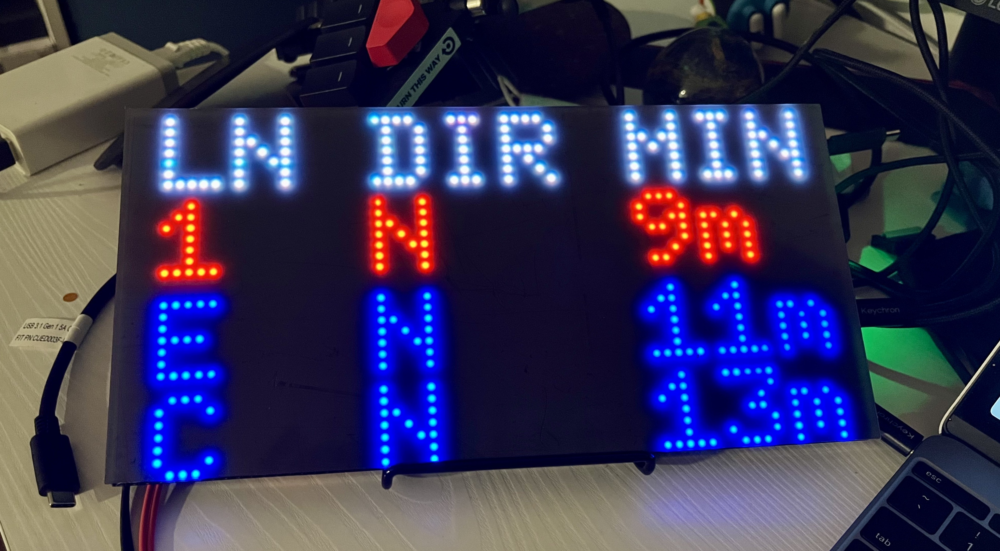
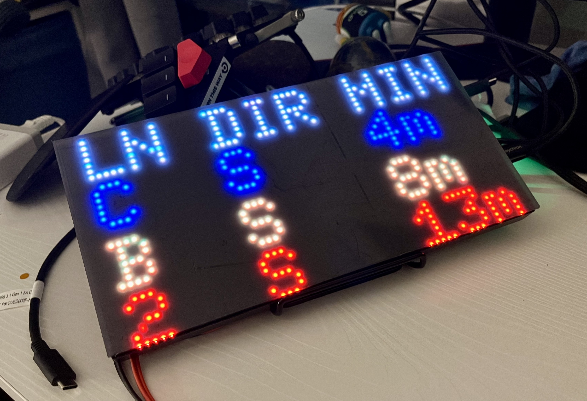

# MTA Dash

This repo holds the code for my personal MTA departure dashboard which I reference in the mornings before heading to work. I call it MTA _Dash_ both for "dashboard" and for all the times I end up running to the station to catch the train. It is heavily inspired (basically stolen) from alejandrorascovan's [MTA Portal](https://github.com/alejandrorascovan/mta-portal/) which is far prettier, which prompted me to purchase an [Adafruit Matrix Portal Starter Kit](https://www.adafruit.com/product/4812) and repurpose the code for my own usecase. I've jotted down some of my thoughts and documented usage so that you may use/repurpose this code for your own circumstances. I've also written it in a way that may make that process less painful than it could have been had I not made any attempt at all to make it readable. However, I make no guarantee of its readability, usability, or efficiency. I cobbled this together for myself, and this is not reflective of my personal or professional standards for code. 

Run your own MTA Portal on CircuitPython to display trains arrivals using Adafruit's [hardware](https://www.adafruit.com/product/4812) and libraries.

Follow Adafruit main [tutorial](https://learn.adafruit.com/adafruit-matrixportal-m4) to set up your MatrixPortal.

## Config

You'll need your own `secrets.py`. Check [here](https://learn.adafruit.com/adafruit-matrixportal-m4/internet-connect) on how to create one.

Config variables:

- `STOP_IDS`: Find your station ID [here](https://github.com/jonthornton/MTAPI/blob/master/data/stations.json)
- `ROUTES`: Train routes you want to track
- `UPDATE_DELAY`: Delay in seconds before fetching new data
- `STATION_MINIMUM_MINUTES_DISPLAY`: Only display arrival times greater or equal than this value. Useful to only show trains you can catch.

## Usecase

This is the scenario for which I optimize. If your circumstance is different, this code may need to be heavily refactored. `configs.py` is set accordingly.

I most frequently take the C, E, or 1 trains. The C and E trains leave from 50th Street Station at 8th Avenue, which is safely a 7 minute walk. The 1 leaves from 50th Street Station at Broadway, which is 9 minutes away. Before I walk out the door, I want to see what the three soonest trains are which I can catch. For instance, I don't want to know that a 1 heading north is leaving in 7 minutes because there's no way I'd make it to the station in time, but I do want to know if an E is leaving in 7 minutes because I could get to that station in time. 

I display the line (in the route's MTA color), the direction (e.g. N for North, S for South), and the number of minutes until it arrives. These lines arrive at different stations. While I could easily display the station (I have a station name attribute for that purpose), at this moment I do not due to lack of real estate and reason in my circumstance (I know the 1 runs along Broadway!).

## Future Work

* An obvious refactor which I haven't done due to laziness and the fact that I am currently only using this board to track one station. When multiple stations' trains are displayed, I currently make separate API requests for each one. I should instead use `/by-id/[stop_id],[stop_id],...` and make only one API request per refresh. This will require a refactoring of `get_trains`.
* The API I am using has a `/by-location?lat=[LATITUDE]&lon=[LONGITUDE]` endpoint which displays data for the 5 stations nearest to the provided latitude/longitude pair. If I could figure out how to fit the station name on the board, I could simply display the nearest and soonest `n` trains, filtered for which stations one wants to travel to and how long it takes to get to each one. 
